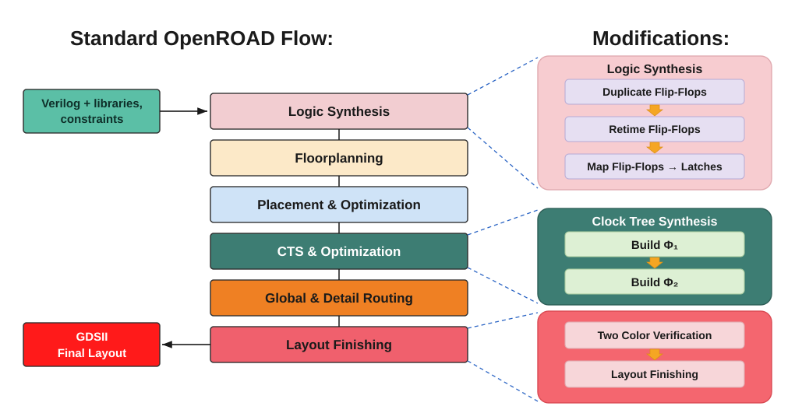

# ORFS-FF2Latch

ORFS-FF2Latch is the first fully automated open-source flow for converting single-phase, edge-triggered flip-flop RTL into two-phase, non-overlapping latch-based designs, integrated into OpenROAD-flow-scripts. It combines Yosys technology mapping, ABC retiming, dual clock tree synthesis, and two-coloring static verification to deliver end-to-end RTL-to-GDS implementation for both clock-gated and recirculation-mux latch variants.

## Two Phase Flow



## Usage

Launch the OpenROAD-flow-scripts Docker environment from the repo root:

```bash
./tp-docker.sh
```

### Smoke Test

Inside the container, run the two-color verification target on the sky130hd GCD design:

```bash
make DESIGN_CONFIG=./designs/sky130hd/gcd/config.mk twocolor
```

## Citation

This repository accompanies the paper *"An Open-Source Flow for Single-Phase, Edge-Triggered to Two-Phase, Non-Overlapping Clocking Conversion"* by Paolo Pedroso, Lee-Way Wang, and Matthew R. Guthaus (University of California Santa Cruz), to appear in the *Proceedings of the Great Lakes Symposium on VLSI 2026 (GLSVLSI '26)*, June 22–24, 2026, Canandaigua, NY, USA.

- DOI: [10.1145/3787109.3815265](https://doi.org/10.1145/3787109.3815265)
- arXiv preprint: [arXiv:2605.05374](https://arxiv.org/abs/2605.05374)

```bibtex
@inproceedings{Pedroso2026TwoPhase,
  author    = {Paolo Pedroso and Lee-Way Wang and Matthew R. Guthaus},
  title     = {An Open-Source Flow for Single-Phase, Edge-Triggered to Two-Phase, Non-Overlapping Clocking Conversion},
  booktitle = {Proceedings of the Great Lakes Symposium on VLSI 2026 (GLSVLSI '26)},
  year      = {2026},
  month     = jun,
  address   = {Canandaigua, NY, USA},
  publisher = {ACM},
  doi       = {10.1145/3787109.3815265},
  note      = {To appear}
}
```

A machine-readable citation is provided in [CITATION.cff](CITATION.cff); GitHub will render a "Cite this repository" button on the repo page.

## ORFS Documentation

For the original OpenROAD-flow-scripts README (upstream documentation, build instructions, design configuration), see [OPENROAD-DOC.md](OPENROAD-DOC.md).
